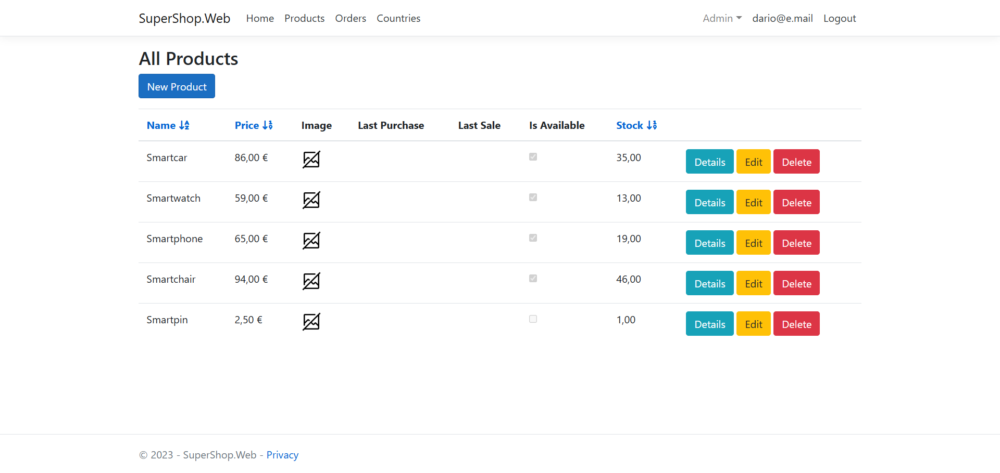
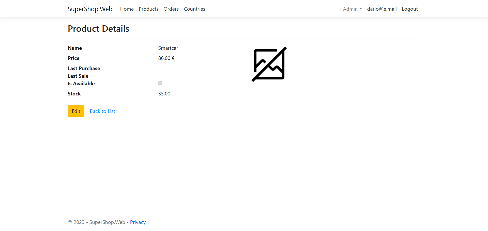
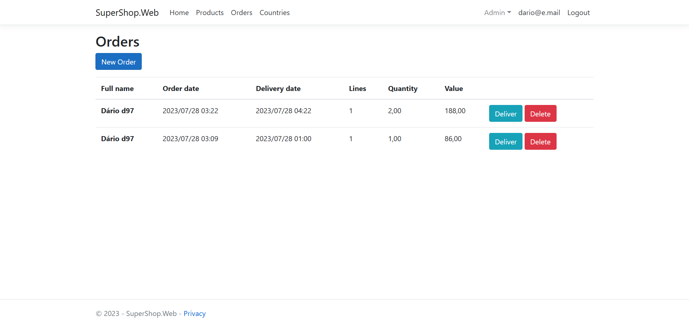
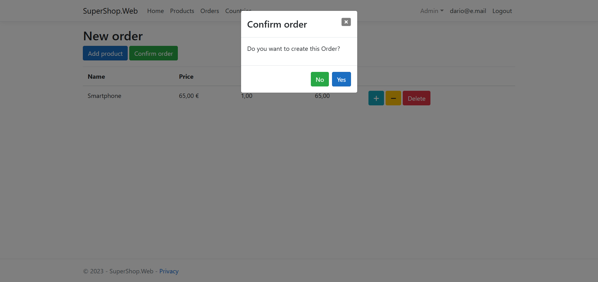
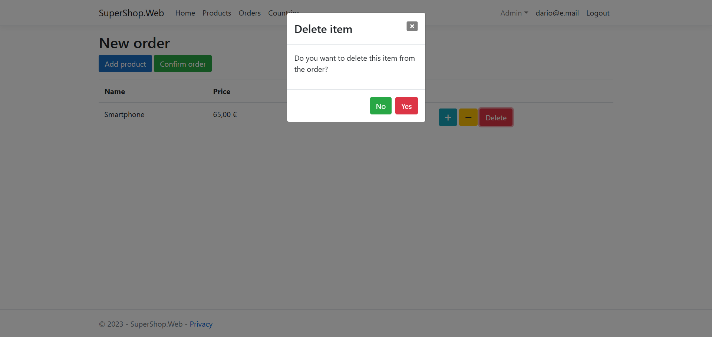
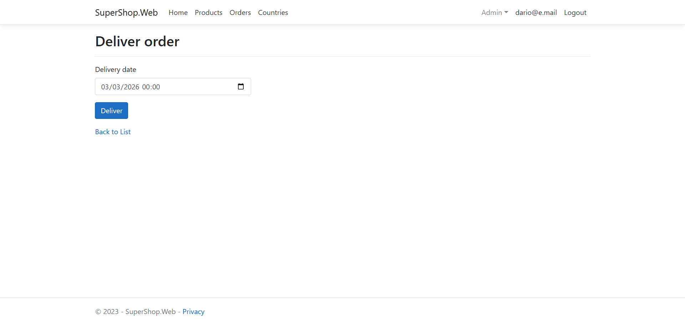
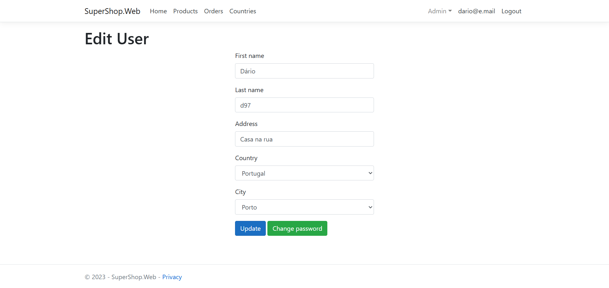
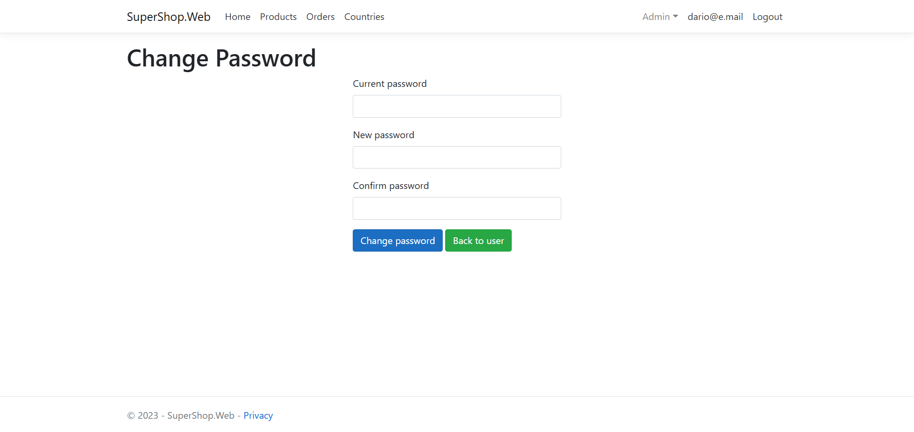

# 🛒 SuperShop

A training project for a simple online shopping experience.

This project was developed as a learning pathway into ASP.NET Core and, more generally, backend web app development.

> ⚠️ This repository is for showcase purposes only and is not intended for production or public use.

---

## 🎯 Project Main Goals

- Practice building a structured web application
- Learn and apply MVC and MV-VM architectures
- Apply design patterns such as Dependency Injection and Repository
- Manage external packages via NuGet
- Use third-party frontend libraries (jQuery, Bootstrap and Font-Awesome)
- Introduction to Git

---

## ✨ Features Demonstrated

### 🔐 Authentication and Account Management

- User registration with email confirmation
- Password recovery through registered email
- Profile editing

### 🛍 Product Catalog

- Product listing
- Sort by Name, Price and Quantity
- Create, edit and delete

### 📦 Order management

- Create order
- Add/remove items with quantities
- Price calculation
- Deliver/cancel

---

## 📷 Application Preview

### 🛍️ Products

#### Listing

#### Details

### 📦 Orders

#### Listing

#### Confirm create order

#### Confirm delete item

#### Deliver

### 🔐 Account Management

#### Edit User

#### Change Password

####

---

## 🛠 Technologies Used

- C# / .NET
- ASP.NET Core 5 
- HTML  
- jQuery
- Bootstrap
- FontAwesome

---

## 📚 What I Learned

- Structuring a multi-layered application
- Code-first approach to database operations (EF Core)
- Asynchronous programming
- Code quality over line reduction
- Organizing reusable components with partial views
- Basic Git operations through VS Git
